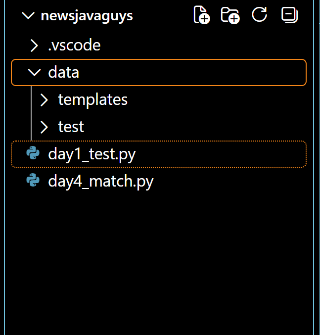

# 資料夾與標註規格 (Data Spec)

## 1. 專案目錄結構
```text
TW16-Mahjong-Agent/
├── configs/          # 設定檔目錄
├── data/             # 資料目錄
│   ├── raw/          # 原始測試圖片
│   ├── processed/    # 預處理後影像
│   └── samples/      # 42 張牌面模板 (0.png ~ 41.png)
├── docs/             # 專案文檔目錄
│   └── perception/   # 視覺模組規格文檔與圖片
├── src/              # 主程式碼目錄
└── main.py           # 專案入口點
```

## 2. 標註與結構驗證
將測試圖像與模板資料庫分離，以利進行自動化矩陣比對。

