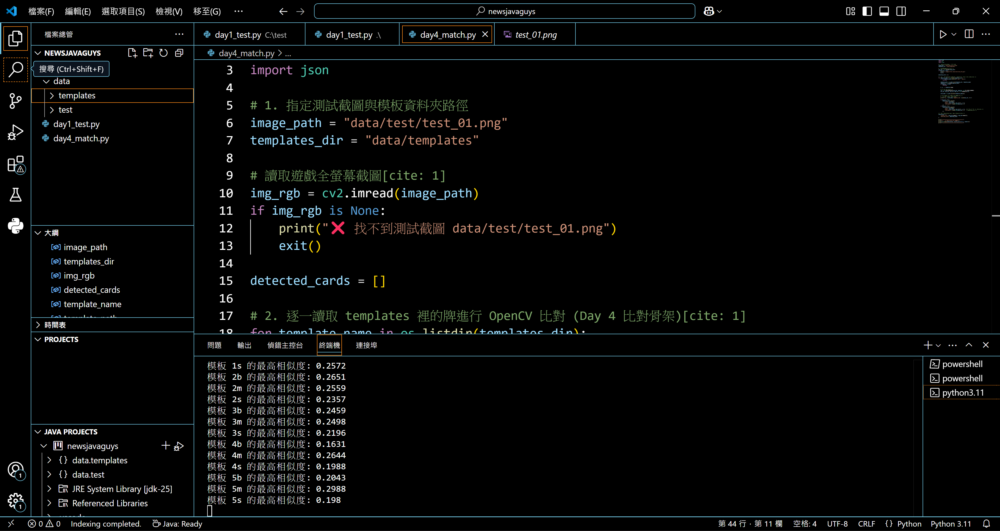
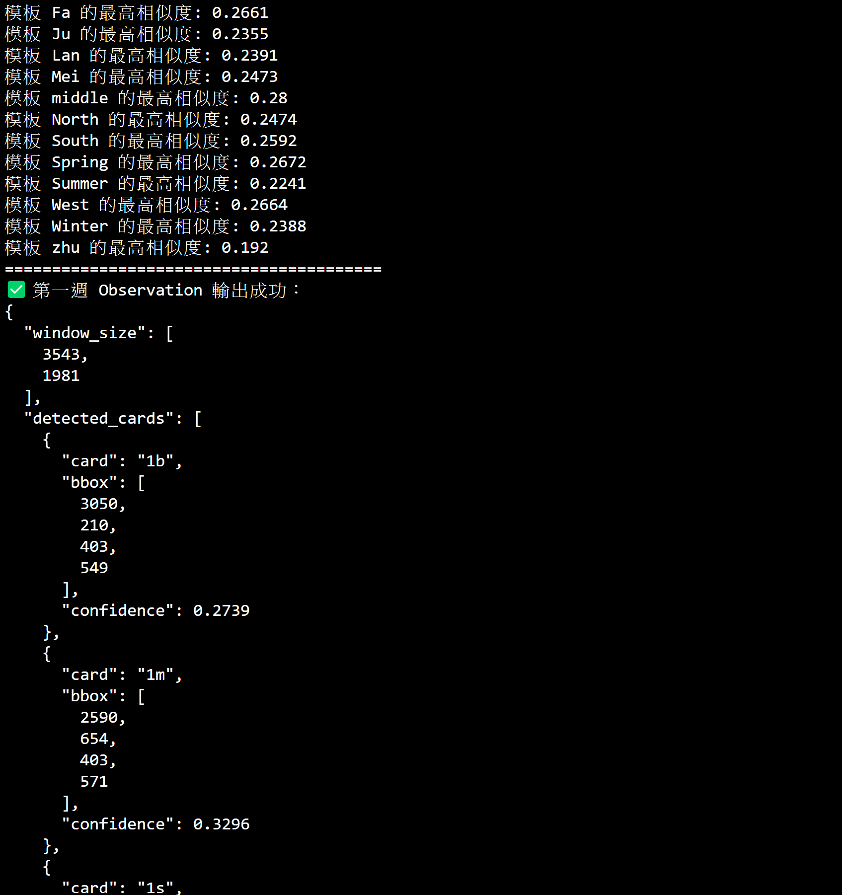
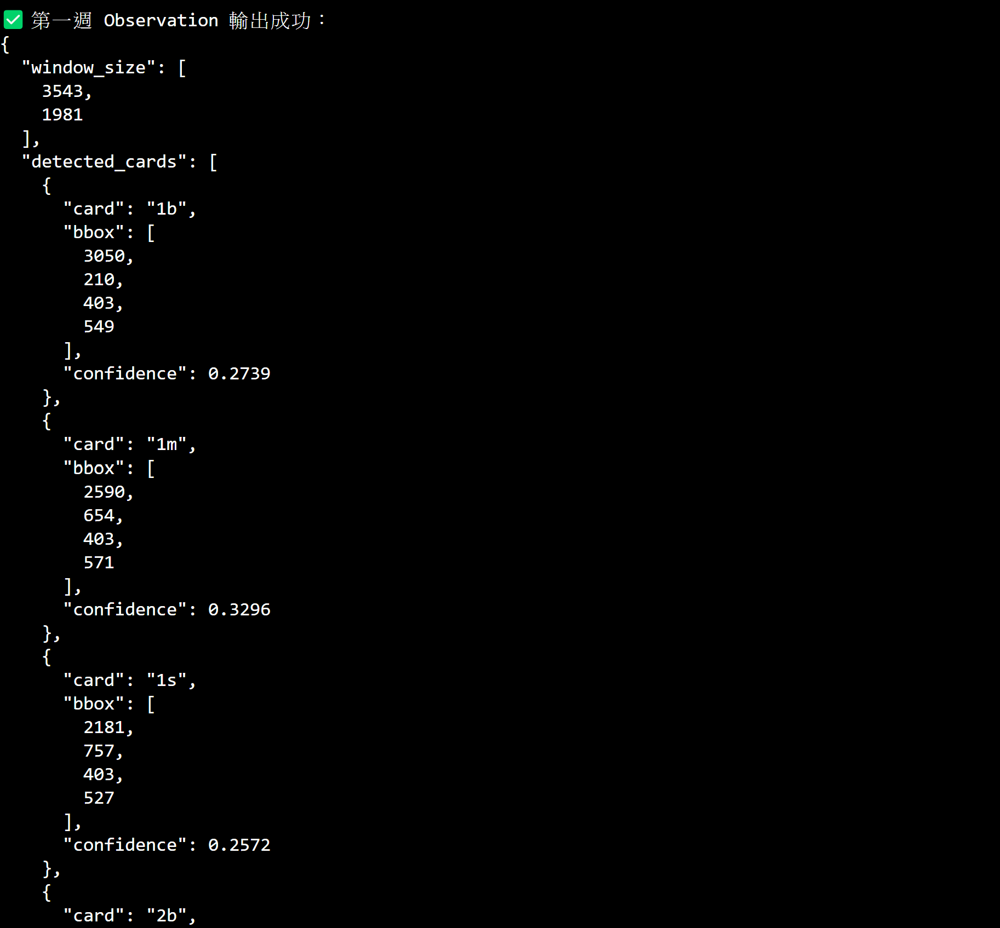

# Observation 格式說明 (Observation Spec)

## 1. 資料結構規範
視覺模組最終輸出標準 Observation JSON 結構如下：
* `window_size`: 畫面解析度 `[width, height]`
* `detected_cards`: 偵測到的牌面陣列
  * `card`: 牌型數字 ID (`"0"` ~ `"41"`)
  * `bbox`: 位置座標 `[X, Y, 寬, 高]`
  * `confidence`: 比對信心分數

## 2. 驗收輸出範例
成功輸出標準 JSON 資料供邏輯與整合模組串接。

