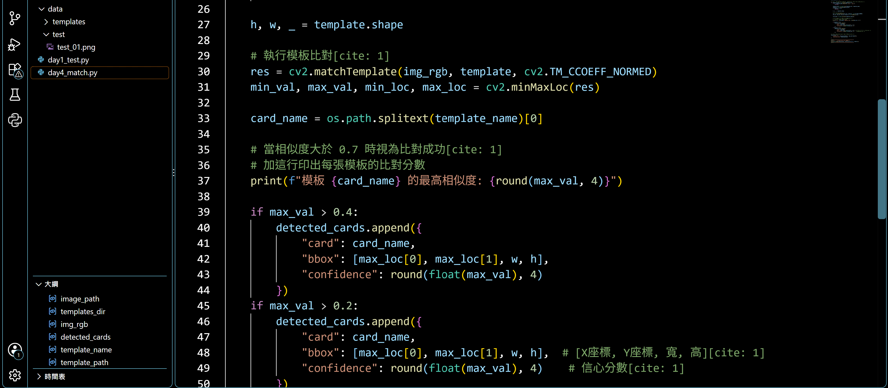

#### 📄 `docs/perception/roi_spec.md`
```markdown
# ROI 與模板比對說明 (ROI & Matching Spec)

## 1. 演算法機制
* **比對核心**：使用 OpenCV `cv2.matchTemplate` 演算法。
* **計算方式**：對全螢幕遊戲畫面與 `data/templates/` 內的 42 張模板圖進行矩陣滑動比對。
* **門檻設定**：計算相似度分數 `max_val`，並以動態門檻進行牌型定位。

## 2. 比對過程驗證
可在 Terminal 輸出各模板之最高相似度數值與座標位置。

