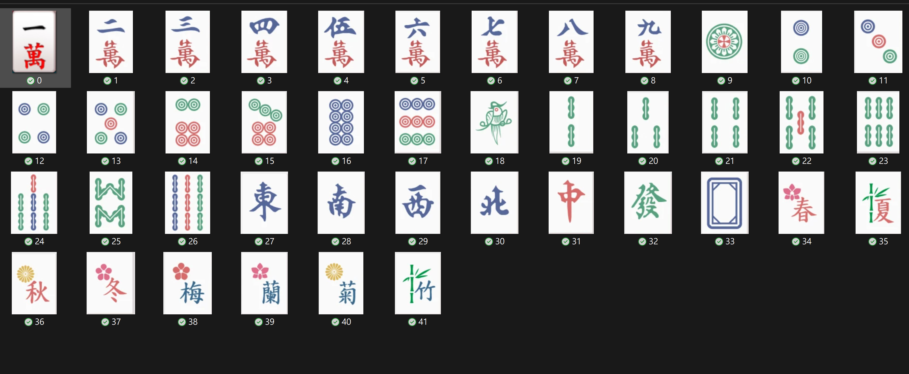

# 牌種與花牌分類規格 (Tile Classes Spec)

## 1. 牌型代碼與命名規範 (0 - 41)
* **萬子 (0 - 8)**：1萬 ~ 9萬 (`0` ~ `8`)
* **筒/餅 (9 - 17)**：1筒 ~ 9筒 (`9` ~ `17`)
* **條/索 (18 - 26)**：1條 ~ 9條 (`18` ~ `26`)
* **風牌 (27 - 30)**：東、南、西、北 (`27`, `28`, `29`, `30`)
* **三元牌 (31 - 33)**：中、發、白 (`31`, `32`, `33`)
* **花牌 (34 - 41)**：春、夏、秋、冬、梅、蘭、菊、竹 (`34` ~ `41`)

## 2. 模板庫展示
共包含 42 張標準化裁切之牌面與花牌模板。

